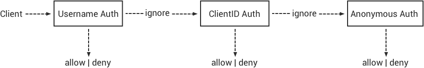
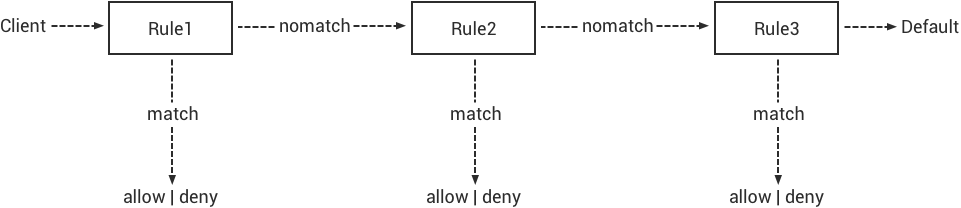

# emq 入门
## 一. emq x 概述
### 1.EMQ X 消息服务器默认占用的 TCP 端口包括:
    1883	MQTT 协议端口
    8883	MQTT/SSL 端口
    8083	MQTT/WebSocket 端口
    8081	HTTP API 端口
    18083	Dashboard 管理控制台端口
### 2.认证/访问控制
    EMQ X 消息服务器 连接认证 和 访问控制 由一系列的认证插件(Plugins)提供，他们的命名都符合 emqx_auth_<name> 的规则
    
    连接认证: EMQ X 校验每个连接上的客户端是否具有接入系统的权限，若没有则会断开该连接
    访问控制: EMQ X 校验客户端每个 发布(Publish)/订阅(Subscribe) 的权限，以 允许/拒绝 相应操作

#### 1）.认证
    EMQ X 消息服务器认证由一系列认证插件(Plugins)提供，系统支持按用户名密码、ClientID 或匿名认证。
    
    系统默认开启匿名认证(Anonymous)，通过加载认证插件可开启的多个认证模块组成认证链:

#### 2）.访问控制
**MQTT 客户端发起订阅/发布请求时，EMQ X 消息服务器的访问控制模块会逐条匹配 ACL 规则，直到匹配成功**

### 3.共享订阅
[共享订阅链接](./client/共享订阅.md)

### 4.HTTP 发布接口
**EMQ X 消息服务器提供了一个 HTTP 发布接口，应用服务器或 Web 服务器可通过该接口发布 MQTT 消息:**

`HTTP POST http://host:8080/api/v3/mqtt/publish`

**curl**

    curl -v --basic -u user:passwd -H "Content-Type: application/json" -d \
    '{"qos":1, "retain": false, "topic":"world", "payload":"test" , "clientid": "C_1492145414740"}' \-k http://localhost:8080/api/v3/mqtt/publish
    
**HTTP 接口参数:**

    参数	        说明
    clientid	MQTT 客户端 ID
    qos	        QoS: 0 | 1 | 2
    retain	    Retain: true | false
    topic	    主题(Topic)
    payload	    消息载荷
    
### 5.MQTT WebSocket 连接
**EMQ X 还支持 WebSocket 连接，Web 浏览器可直接通过 WebSocket 连接至服务器:**
    
    WebSocket URI:	            ws(s)://host:8083/mqtt
    Sec-WebSocket-Protocol:	    ‘mqttv3.1’ or ‘mqttv3.1.1’

    