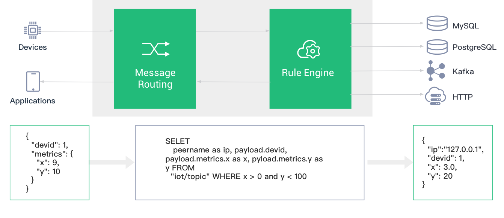

# 规则引擎
    EMQ X Broker Rule Engine 用于配置 EMQ X Broker 消息流与设备事件的处理、响应规则。
    规则引擎不仅提供了清晰、灵活的 "配置式" 的业务集成方案，简化了业务开发流程，提升用户易用性，
    降低业务系统与 EMQ X Broker 的耦合度；也为 EMQ X Broker 的私有功能定制提供了一个更优秀的基础架构。
    

## 一。EMQ X Broker 在 消息发布或事件触发 时将触发规则引擎，满足触发条件的规则将执行各自的 SQL 语句筛选并处理消息和事件的上下文信息

### 1.消息发布
    选择发布到 t/# 主题的消息，并筛选出全部字段：
    SELECT * FROM "t/#"
    
    选择发布到 t/a 主题的消息，并从 JSON 格式的消息内容中筛选出 "x" 字段：
    SELECT payload.x as x FROM "t/a"
### 2.事件触发
    则引擎使用 $events/ 开头的虚拟主题（事件主题）处理 EMQ X Broker 内置事件，内置事件提供更精细的消息控制和客户端动作处理能力
    
    选择客户端连接事件，筛选 Username 为 'emqx' 的设备并获取连接信息：
    SELECT clientid, connected_at FROM "$events/client_connected" WHERE username = 'emqx'

## 二.规则引擎的结构
**主要有三部分**

+ 触发事件：消息发布/事件触发等方式，通过 SQL 的 FROM 子句指定事件类型
+ 处理规则：使用 SELECT 子句 和 WHERE 子句以及内置处理函数
+ 响应动作：规则将输出结果执行相应的动作，如持久化到数据库、重新发布处理后的消息、转发消息到消息队列等。一条规则可以配置多个响应动作
   
        eg: 规则: {
                   SQL 语句,
                   动作列表: [
                       {
                           动作1,
                           动作参数,
                           绑定资源: {
                               资源配置
                           }
                       },
                       {
                           动作2,
                           动作参数,
                           绑定资源: {
                               资源配置
                           }
                       }
                   ]
               }
## 三.规则引擎典型应用场景
+ 动作监听（告警）：智慧家庭智能门锁开发中，门锁会因为网络、电源故障、人为破坏等原因离线导致功能异常，使用规则引擎配置监听离线事件向应用服务推送该故障信息，可以在接入层实现第一时间的故障检测的能力；
+ 数据筛选：车辆网的卡车车队管理，车辆传感器采集并上报了大量运行数据，应用平台仅关注车速大于 40 km/h 时的数据，此场景下可以使用规则引擎对消息进行条件过滤，向业务消息队列写入满足条件的数据；
+ 消息路由：智能计费应用中，终端设备通过不同主题区分业务类型，可通过配置规则引擎将计费业务的消息接入计费消息队列并在消息抵达设备端后发送确认通知到业务系统，非计费信息接入其他消息队列，实现业务消息路由配置；
+ 消息编解码：其他公共协议 / 私有 TCP 协议接入、工控行业等应用场景下，可以通过规则引擎的本地处理函数（可在 EMQ X Broker 上定制开发）做二进制 / 特殊格式消息体的编解码工作；亦可通过规则引擎的消息路由将相关
  消息流向外部计算资源如函数计算进行处理（可由用户自行开发处理逻辑），将消息转为业务易于处理的 JSON 格式，简化项目集成难度、提升应用快速开发交付能力。
